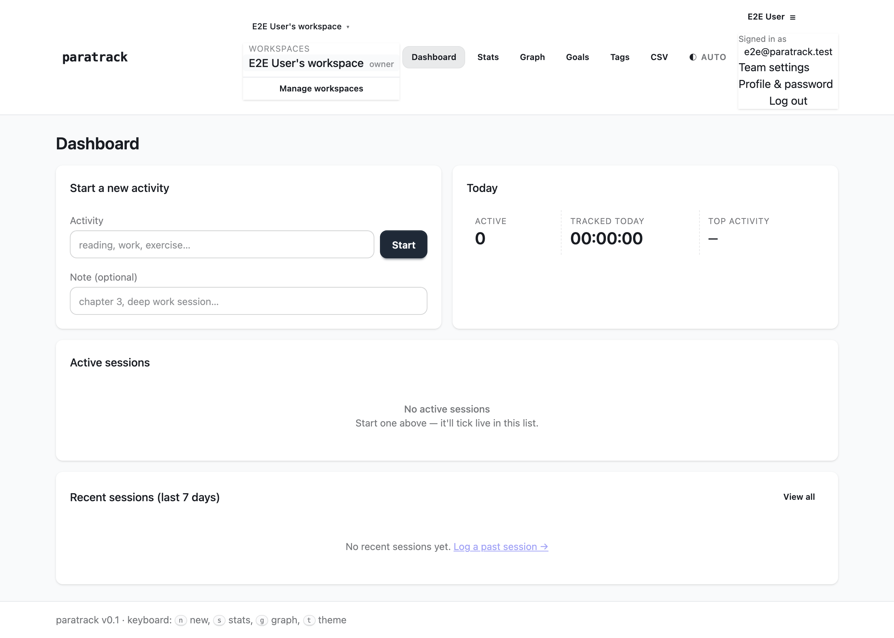
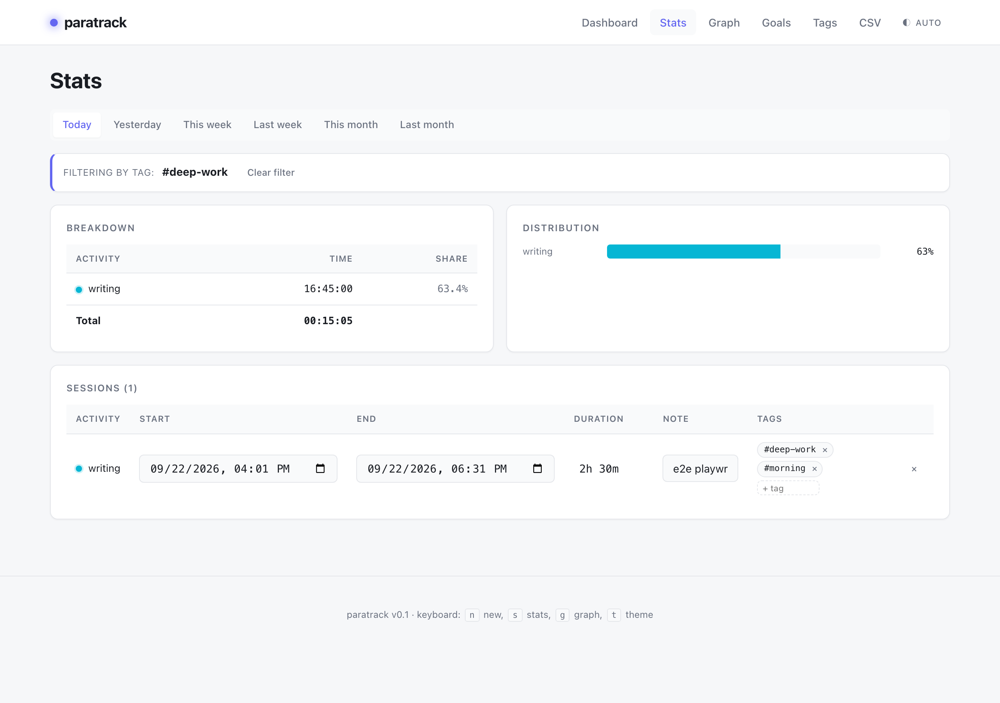
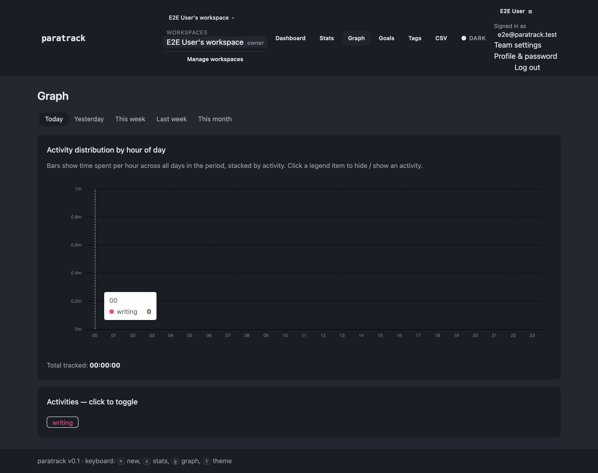

# paratrack

Minimalist time tracker with parallel activities, advanced analytics, multi-user team workspaces, and a single-binary web UI. Pure Go, zero CGO, zero Node runtime.





## Why

Most time trackers are either 5 MB-JS web apps or CLI tools with no visual feedback. paratrack is both: one 20 MB Go binary gives you a fully-interactive web UI plus the same commands on the terminal — and now also team workspaces with shared activity catalogs, invite links, and per-team scoping.

## Quickstart

```bash
make build    # auto-runs `make ui` (npm install + CSS bundle)

# First launch: open the web UI and register your account.
./paratrack web --addr 127.0.0.1:8000
# → http://127.0.0.1:8000/login  (sign up there)

# CLI (uses your account's personal team)
./paratrack web --open                  # opens browser to /
./paratrack web --addr 0.0.0.0:8000     # listen on all interfaces
```

Data lives at `~/.track/track.db` (SQLite). On first launch with auth enabled, a pre-auth single-user DB is archived to `~/.track/track.db.bak.<timestamp>` and a fresh schema is created — collaboration can't coexist with the old anonymous schema.

## UI stack

Server-rendered `html/template` + a single vendored CSS bundle (~16 KB minified) generated from Tailwind v4 + DaisyUI v5 in `web/`. No JS framework runtime — HTMX + Alpine.js + ECharts are vendored as static files and embedded via `go:embed`. To tweak the design, edit `web/input.css` and run `make ui`.

## Features

- **Multi-user + team workspaces.** Email + bcrypt password sign-up; every account gets a personal team on registration; create more teams from `/settings/team`; invite teammates via token link (7-day TTL).
- **Workspace switcher.** Top-bar dropdown lists every team you belong to with your role; the cookie remembers your last choice.
- **Per-team scoping.** Activities, sessions, tags, goals, and progress all live inside one team — two teams don't see each other's rows, even though it's all one SQLite file.
- **Per-activity colour coding.** Each activity name hashes to one slot of a 10-colour muted palette; the same colour is used for the activity name, the legend chips, and the stacked-bar segments on `/graph`, so the eye follows the activity across pages.
- **Role-based access.** Owners can rename/delete the team, generate and revoke invite links, and remove members; members can leave but not manage.
- Parallel timers, pause / resume, focus / switch
- Backfill via natural-language time
- Inline edit of start / end / duration / note in the stats table
- Inline tags: type + Enter on any session row
- Tag filter (`/stats?tag=deep-work`)
- Per-activity goals (daily / weekly / monthly) with live progress
- ECharts graph: stacked hour-of-day bars, clickable legend
- CSV export
- Light / dark / auto theme; toggle with the button or `t` key
- Keyboard shortcuts: `n` new · `s` stats · `g` graph · `d` dashboard · `t` theme
- Live-ticking durations
- Mobile-friendly tables (collapse to cards on phones)
- Hover tooltips on graph bars

## CLI reference

| Command | Aliases | Description |
|---|---|---|
| `paratrack` / `status` | `st` | List active sessions |
| `paratrack start <name>` | — | Quick-start (asks note) |
| `paratrack stop [name]` | `s` | Stop one (or all) |
| `paratrack pause [name]` | `p` | Pause one (or all) |
| `paratrack resume [name]` | `r` | Resume one (or all) |
| `paratrack focus <name>` | `sw` | Pause others, resume/start chosen |
| `paratrack add` | `a` | Backfill a session (interactive) |
| `paratrack log` | `l` | Log of closed sessions in a period |
| `paratrack stats` | — | Aggregated breakdown for a period |
| `paratrack goal` | — | Set / list / unset per-activity targets |
| `paratrack tag` | — | Add / list / attach / detach session tags |
| `paratrack web` | — | Launch embedded web UI |

All commands accept `--help`.

The CLI operates on a **legacy no-team scope** — it talks to rows whose `team_id = 0`. Use it for back-filling personal data; for team collaboration, drive everything through the web UI.

## Time parsing

`paratrack add`, `paratrack log`, and the inline duration input accept:

```
now, today, yesterday, tomorrow
2026-09-22 14:00
2026-09-22T14:00:00Z
14:30
yesterday 14:00
last monday
last friday 18:00
2 hours ago, 30 min ago, 1 day ago, 2 weeks ago
```

Durations:

```
90              # 90 minutes
1h, 1.5h        # hours
30m, 90m, 45 minutes
1h 30m, 2h30m   # compound
1.5             # 1.5 minutes
```

## Architecture

```
paratrack/
├── cmd/paratrack/main.go     CLI dispatch (legacy single-user scope)
├── internal/
│   ├── cli/                  stdin prompt helpers
│   ├── db/                   SQLite layer (modernc.org/sqlite, pure-Go)
│   ├── model/                domain types (Activity/Session/Tag/Goal all carry TeamID)
│   ├── auth/                 users, sessions, bcrypt, cookie helpers
│   ├── teams/                teams, memberships, invites, role checks
│   ├── timeparse/            NL time + duration parser
│   └── web/                  HTTP server + handlers + RequireAuth middleware
│       ├── templates/        base + 7 pages (login, register, dashboard, stats,
│       │                     graph, goals, tags, team-settings, members,
│       │                     invites, profile, invite-accept)
│       └── static/           vendored CSS, htmx, alpine, echarts, app.js
├── web/                      Tailwind + DaisyUI source (`make ui` builds it)
├── e2e/                      Playwright suite
└── go.mod / go.sum
```

The web UI is server-rendered HTML augmented by HTMX (targeted swaps), Alpine.js (live-ticking durations, theme toggle), and ECharts (graph). No Node, no build step, no CDN — everything is `//go:embed`-ed.

### Auth & teams

The `RequireAuth` middleware sits in front of every page route and every `/api/*` route (other than the auth flow itself). It reads the `paratrack_session` HttpOnly cookie, looks up the session row + user in one round-trip, touches `last_seen_at`, attaches `User` and current `Team` to `r.Context()`, and dispatches. Page failures get a `303 → /login?next=…`; API failures get `401 {"error":"unauthorized"}` JSON.

Every authenticated query is scoped by `team_id`. The middleware resolves the current team from the `paratrack_team` cookie (or falls back to the user's personal team). All db helpers take `teamID int64` as their first arg; pass `0` for the legacy CLI / test path.

### Schema migration: hard break

The collaboration layer can't be layered on top of the anonymous single-user schema. On first launch after this release, `db.Open` detects a pre-auth DB by checking for the presence of the `users` table; if missing, it renames `track.db` to `track.db.bak.<UTC-timestamp>` (along with `-wal` / `-shm` siblings) and creates a fresh schema. The existing CLI commands keep working against the same path — no config change, no manual migration.

## Testing

End-to-end (Playwright):

```bash
python3 -m venv .venv
source .venv/bin/activate
pip install playwright
python -m playwright install chromium

./paratrack web --addr 127.0.0.1:8888 &
python e2e/test_dashboard.py    # 45/45
```

Go unit tests:

```bash
go test ./... -race
```

## Stack

- **Go 1.27** — tested
- **modernc.org/sqlite** — pure-Go, no CGO
- **net/http 1.22+** — stdlib method routing
- **html/template** — server rendering
- **HTMX 2.0.4** + **Alpine.js 3.14.1** — vendored
- **ECharts 5.5.1** — vendored (~1 MB)
- **Tailwind v4** + **DaisyUI v5** — CSS source in `web/`

## License

MIT

## Changelog

See [CHANGELOG.md](./CHANGELOG.md).
