# paratrack

Минималистичный учёт времени: параллельные активности, командные пространства, инвойсы и оплата. Один Go-бинарник с встроенным веб-интерфейсом. Без CGO, без Node в рантайме.

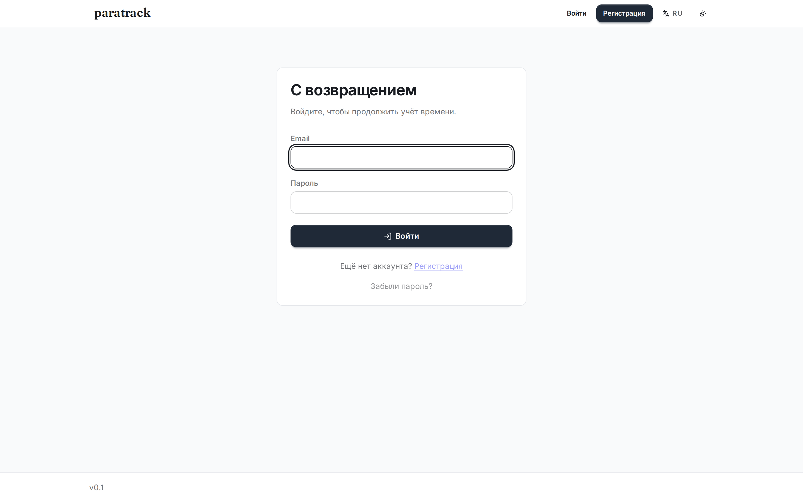
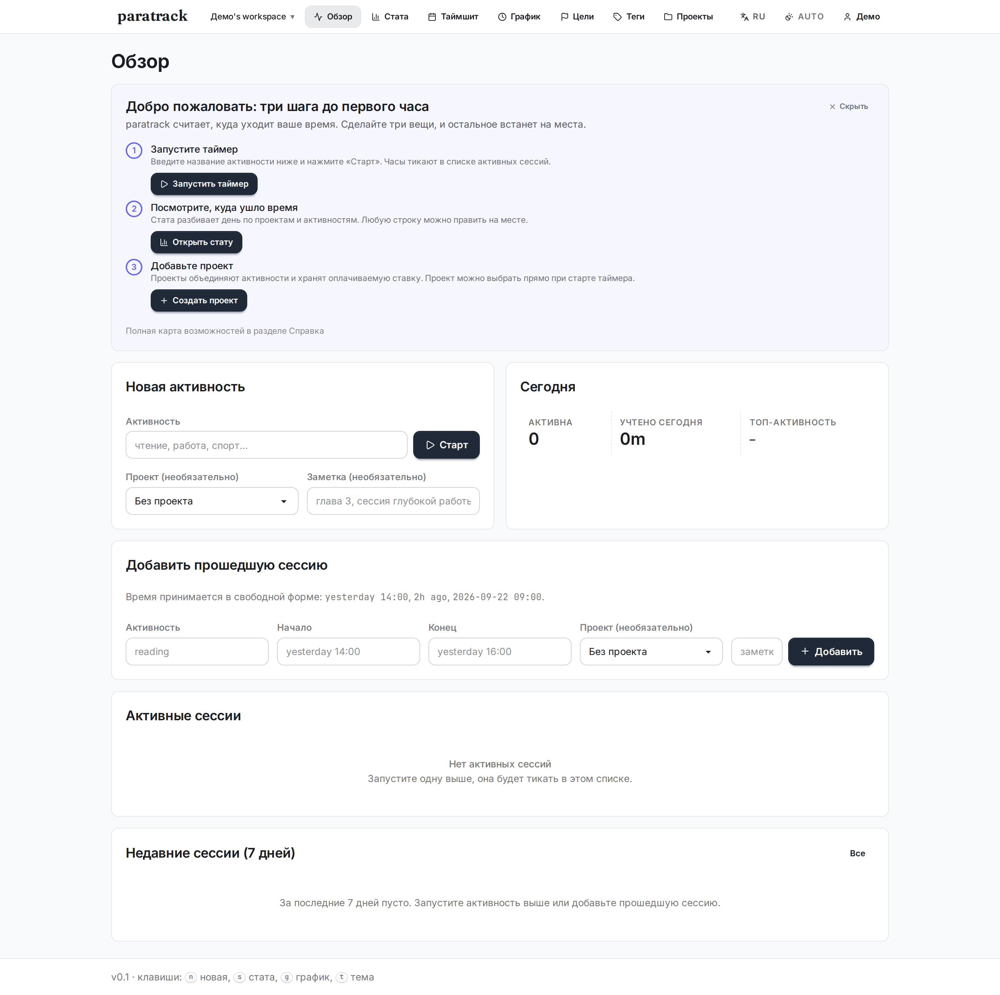

## Зачем

Большинство трекеров времени делятся на два лагеря: тяжёлые веб-приложения на несколько мегабайт JavaScript и консольные утилиты без обратной связи. paratrack собирает оба в одном бинарнике на 20 МБ: живой интерфейс с таймером, неделей, отчётами и деньгами, и при этом SQLite-файл, который лежит у вас и нигде больше.

Всё, что нужно команде для учёта времени, уже внутри: таймшит на неделю, оценки против факта, инвойсы с PDF и онлайн-оплатой, расчёт зарплаты, планирование людей по проектам, восемь интеграций и маркетплейс.

## Быстрый старт

```bash
make build    # заодно соберёт CSS (npm install + Tailwind)

./paratrack web --addr 127.0.0.1:8000
# → http://127.0.0.1:8000/login  (здесь регистрируемся)
```

После регистрации открывается обзор с формой «Новая активность» и коротким чек-листом из трёх шагов: запустить таймер, посмотреть стату, завести проект.

Данные лежат в `~/.track/track.db` (SQLite). При первом запуске с включённой авторизацией старая одноимённая база уходит в `~/.track/track.db.bak.<timestamp>` и создаётся свежая схема: совместная работа не уживается со старым анонимным форматом.

## Как выглядит

| | |
|---|---|
| 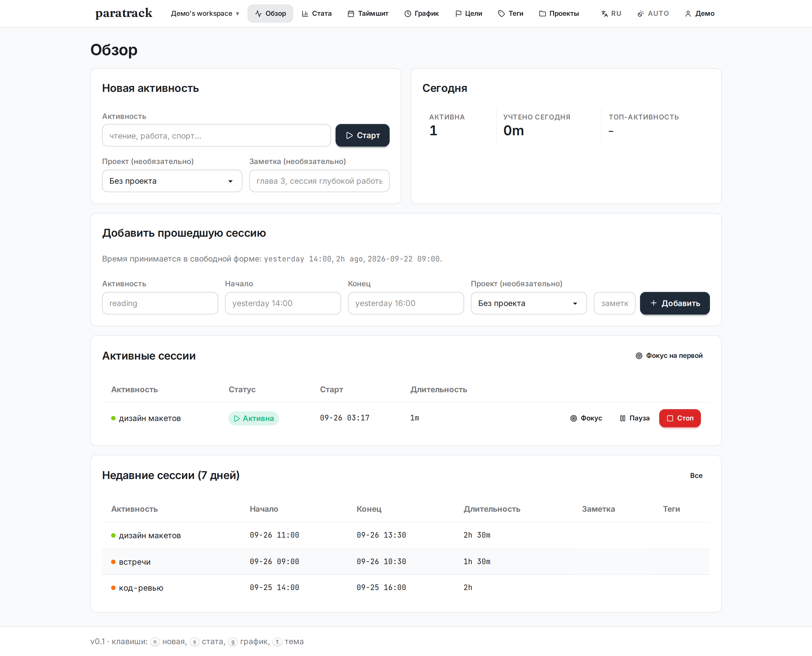 | 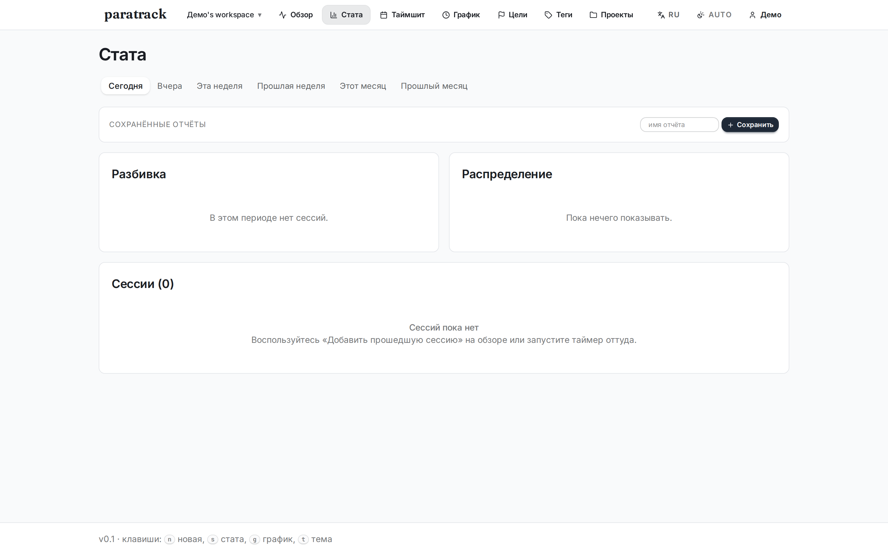 |
| Обзор: таймер, активные сессии, недавние | Стата: разбивка, фильтры, правка на месте |
| 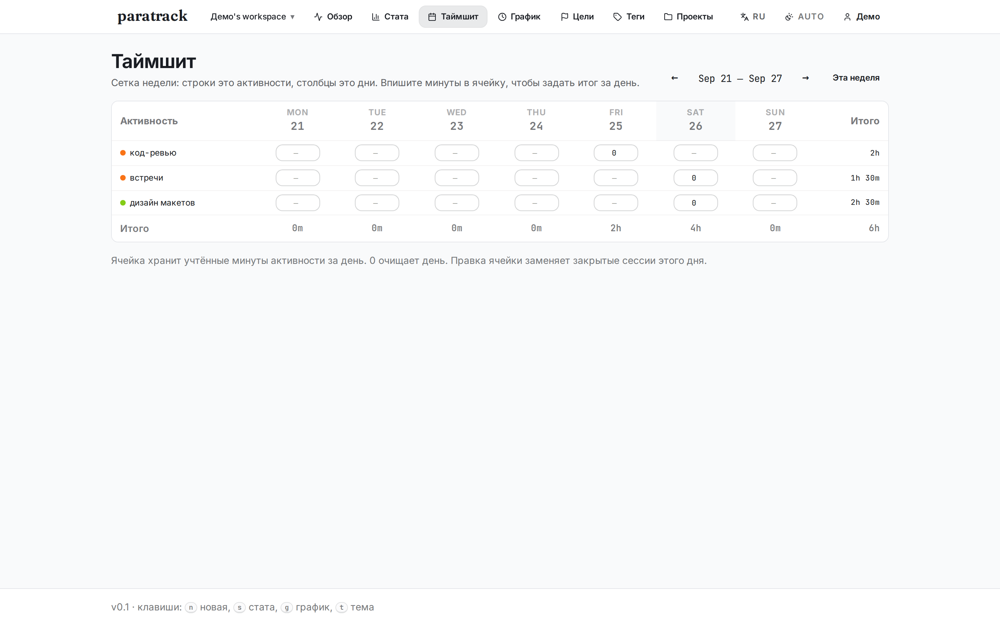 | 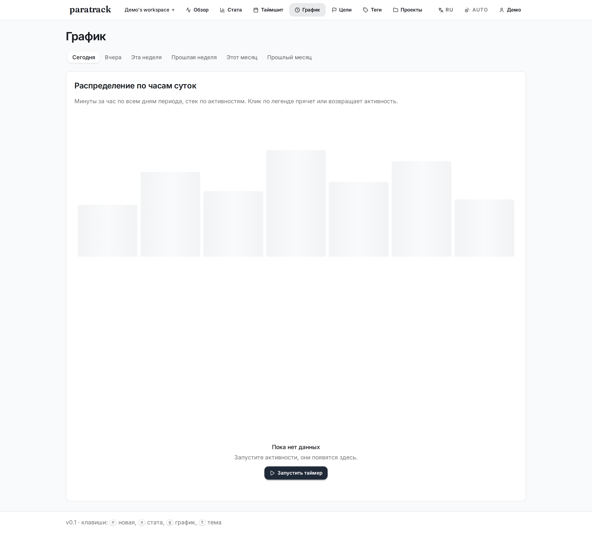 |
| Таймшит: неделя по дням | График: минуты по часам |
| 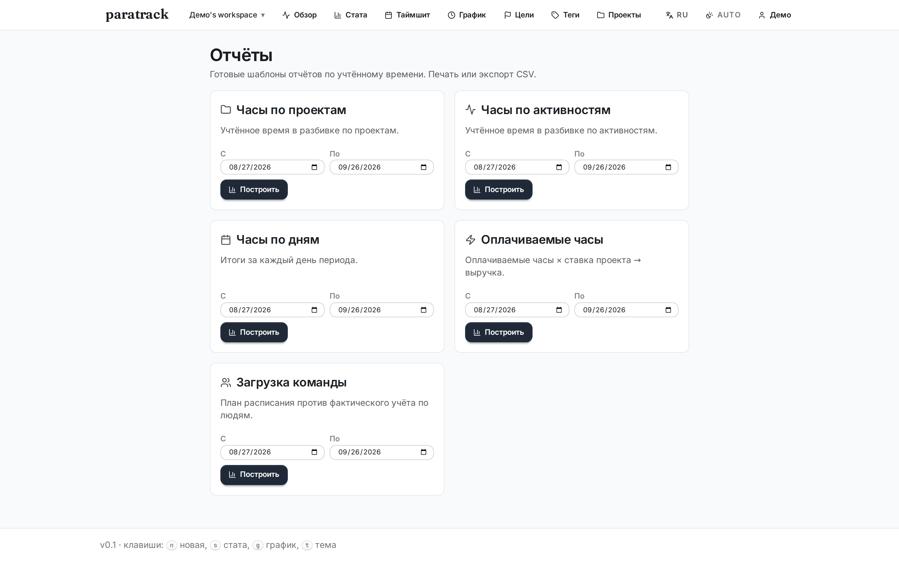 | 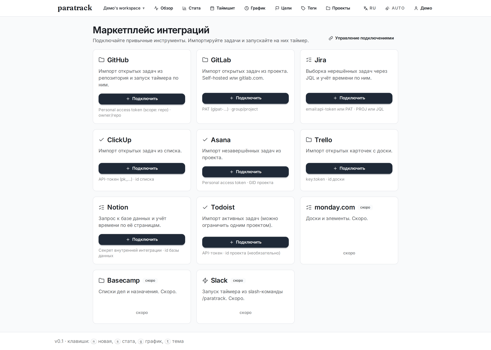 |
| Отчёты: 5 шаблонов, HTML и CSV | Маркетплейс: 11 интеграций |
| 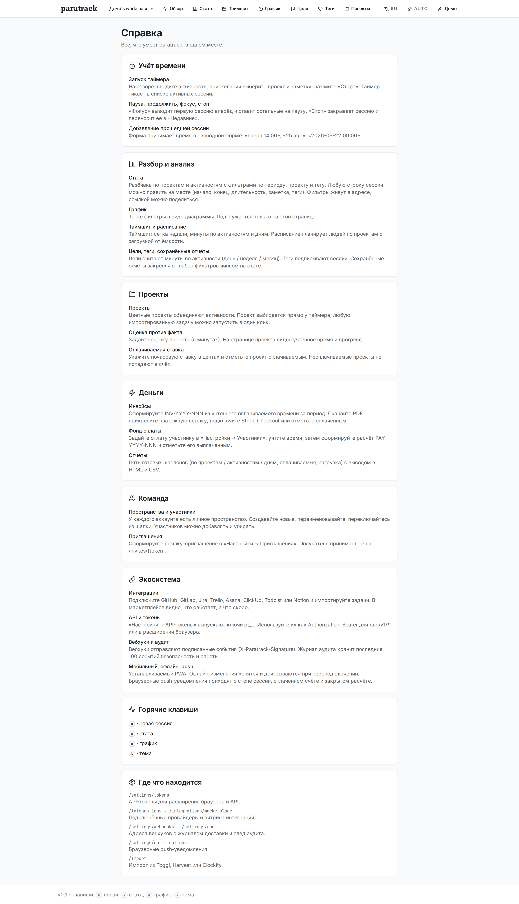 | 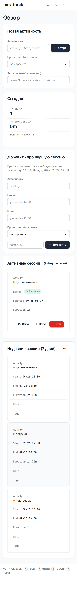 |
| Справка: всё в одном месте | Мобильный: от 320px |

Тёмная тема и переключение auto / светлая / тёмная работают на всех страницах.

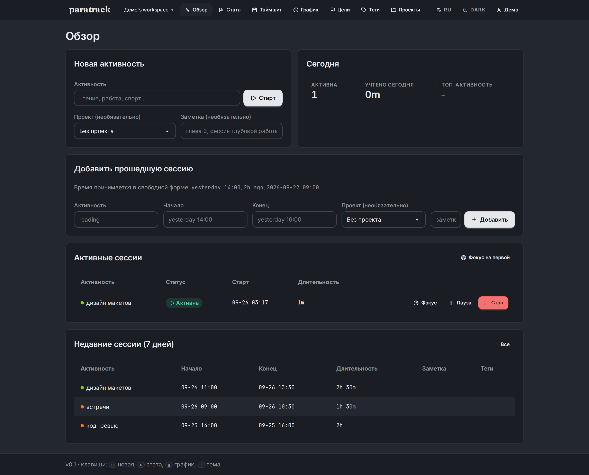

## Что умеет

**Учёт.** Параллельные таймеры, пауза и продолжение, «Фокус» выводит одну сессию вперёд, прошедшие сессии добавляются свободным текстом («вчера 14:00», «2h ago»). Длительность тикает вживую.

**Неделя.** Таймшит: сетка «активность × дни», ячейка хранит минуты за день. Расписание планирует людей по проектам и показывает загрузку от ёмкости.

**Проекты и оценки.** Цветные проекты объединяют активности. Оценка в минутах против факта на карточке проекта, оплачиваемая ставка в центах.

**Деньги.** Инвойсы `INV-ГГГГ-ННН` из учтённого оплачиваемого времени: PDF, платёжная ссылка, Stripe Checkout, отметка «оплачен». Фонд оплаты `PAY-ГГГГ-ННН` считается от ставок участников.

**Отчёты.** Пять готовых шаблонов: по проектам, активностям, дням, оплачиваемые часы, загрузка команды. Вывод в HTML и CSV.

**Команда.** Несколько пространств, участники с ролями и оплатой, приглашения по ссылке.

**Экосистема.** Восемь интеграций: GitHub, GitLab, Jira, Trello, Asana, ClickUp, Todoist, Notion. Импорт задач с однокликовым стартом таймера. Импорт из Toggl, Harvest и Clockify. API-токены, `/api/v1/*`, вебхуки с HMAC-подписью, журнал аудита, вход через SSO (OIDC).

**Мобильный и офлайн.** Устанавливаемый PWA, офлайн-очередь с доигрыванием, push-уведомления в браузере, расширение для Chrome с таймером в попапе.

**Интерфейс.** Русский по умолчанию, есть английский. Светлая и тёмная темы, скелетоны там, где есть ожидание, пустые состояния с понятным следующим шагом, горячие клавиши `n` `s` `g` `t`.

## Стек интерфейса

Страницы рендерятся на `html/template`, стили собираются из Tailwind v4 + DaisyUI v5 в один бандл (~16 КБ). Никакого фреймворка: HTMX для точечных подмен, Alpine.js для живых значений и темы, ECharts для графика. Всё это лежит в репозитории и подключается через `go:embed`. Нет сборки на Node в рантайме и нет внешних CDN.

Чтобы поменять дизайн, правьте `web/input.css` и запустите `make ui`.

## Архитектура

```
paratrack/
├── cmd/paratrack/          точка входа
├── internal/
│   ├── catalog/            маркетплейс и шаблоны отчётов
│   ├── db/                 SQLite (modernc.org/sqlite, без CGO)
│   ├── model/              доменные типы
│   ├── auth/               пользователи, сессии, bcrypt
│   ├── teams/              пространства, участники, приглашения
│   ├── i18n/               словари EN / RU
│   ├── mail/               письма: лог или SMTP
│   ├── timeparse/          разбор времени в свободной форме
│   └── web/                HTTP-сервер, обработчики, шаблоны, статика
├── web/                    исходники Tailwind + DaisyUI (собирает `make ui`)
├── e2e/                    Playwright-проверки
└── docs/                   PRODUCT, QA, JOURNEY
```

### Авторизация и пространства

`RequireAuth` стоит перед каждой страницой и каждым `/api/*`. Кука `paratrack_session` поднимает сессию и пользователя за один запрос, кладёт их в контекст и редиректит на `/login?next=…` для страниц или отдаёт `401` для API. Все выборки ограничены `team_id`; текущее пространство приходит из куки `paratrack_team` или падает обратно на личное.

### Миграция схемы

Совместная работа не накладывается на старую анонимную схему. При первом запуске после обновления `db.Open` проверяет наличие таблицы `users`; если её нет, переименовывает `track.db` в `track.db.bak.<UTC-метка>` и создаёт схему заново.

## Документация

- **[docs/PRODUCT.md](docs/PRODUCT.md)**: карта возможностей, бизнес-логика (время, деньги, инвойсы, зарплата), модель безопасности, HTTP-поверхность, схема данных
- **[docs/QA.md](docs/QA.md)**: матрица проверок, результаты, найденные и починенные баги, договорённости API
- **[docs/JOURNEY.md](docs/JOURNEY.md)**: карта переходов пользователя, схема навигации, пустые состояния
- **[DESIGN.md](DESIGN.md)**: дизайн-система: токены, типографика, кнопки, правила

## Проверка

```bash
go test ./...                                   # юниты и интеграции

python3 -m venv .venv && source .venv/bin/activate
pip install playwright requests
python -m playwright install chromium

python e2e/qa_full.py       # интерфейс и визуал, Playwright со скринами
python e2e/qa_logic.py      # математика денег и времени поверх HTTP
python e2e/wave9_verify.py  # офлайн и push
```

Скриншоты складываются в `e2e/screenshots/`.

## Стек

- **Go 1.27**
- **modernc.org/sqlite**: на чистом Go, без CGO
- **net/http**: маршрутизация из стандартной библиотеки
- **html/template**: серверный рендер
- **HTMX 2.0.4** и **Alpine.js 3.14.1**: лежат в репозитории
- **ECharts 5.5.1**: урезанная сборка под наш график
- **Tailwind v4** + **DaisyUI v5**: исходники стилей в `web/`

## Лицензия

MIT

## Что менялось

Смотрите [CHANGELOG.md](./CHANGELOG.md).
