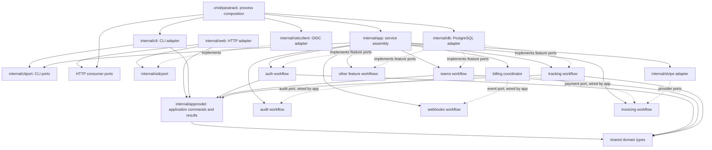

# Architecture

paratrack is a modular Go application shipped as one binary. It has two
entrypoints into the same product: a command-line interface and a server-rendered
HTTP application. PostgreSQL is the durable store. The browser uses HTML from Go
templates, HTMX for server interactions, and small JavaScript modules for local
behavior.

`internal/web/static/js/app.js` is the browser entrypoint. Dedicated modules
register the live timer/total and invoice-form Alpine components. A small
synchronous bootstrap resolves theme and timezone before the page paints. The
remaining behavior is split by responsibility: request and form handling,
navigation and shortcuts, offline replay, export validation, loading feedback,
PWA and push controls, phone navigation, ledger state, charts, theme, toast
feedback, session editing and keyboard focus recovery. Offline coordination
stays in `app-offline.js`; queue serialization, replay policy and banner DOM
have separate modules. `app-time-format.js` exports the localized duration
units shared by timers and charts, rather than exposing a browser global.
Templates provide translated strings as escaped data attributes, while the
architecture check keeps executable behavior out of HTML. The server-generated
import map applies the same asset hash to every embedded JavaScript module.
Tailwind scans the page templates and browser modules. The frontend check
verifies those source declarations, import resolution, cycles and reachability
from scripts loaded by the base template. It also checks that template `x-data`
names have matching Alpine registrations, that browser modules do not publish mutable
state on `window` or `globalThis`, and that every free identifier resolves
through an import or an explicitly configured browser/vendor global. The same
gate audits the npm dependency lockfile.
Offline replay uses an explicit method/path allowlist for timer, ledger,
schedule, tag and goal mutations. Credential, integration, push-subscription and
payment operations stay online-only, so their request bodies are never written
to the browser's persistent queue. Replay revalidates the allowlist and purges
unsupported entries left by older client versions before sending them.

## Runtime shape

`cmd/paratrack` owns process bootstrap and composition; `internal/cli` and
`internal/web` are transport adapters. They parse CLI arguments or HTTP
requests, establish actor and workspace context, call application workflows,
and format output. HTTP templates render into buffers before the adapter sends
response headers or bodies, so a template failure cannot leave a partial page
with a successful status. Internal HTTP failures are logged with their cause
and return a stable message instead of exposing storage/driver errors. The
projects workflow validates and normalizes project input before persistence;
the HTTP adapter maps typed validation errors to client responses. API response
DTOs for projects, goals and tags live in `internal/web`, keeping those JSON
contracts explicit at the transport boundary. HTML pages adapt users, teams,
members, projects, activities, invites, billing rules and saved reports into
view models before rendering. Shared shell data and page-specific dashboard,
stats, goals, active-list and mini-bar models live in focused adapter files;
templates never receive those full domain records. Route handlers share
request/application helpers instead of invoking one another, so each route
retains its own response contract. HTTP authentication ports and request
context carry `appmodel.UserIdentity`, which omits the stored password hash;
full user records remain inside the auth workflow and persistence adapter.
Page and fragment renderers accept separate sealed view-model interfaces, so
domain records cannot be passed to templates directly. Page models must expose
CSRF and language setters, making request-specific template context explicit
and compile-time checked instead of silently optional.
The JSON response helpers accept only named adapter DTOs that implement the
HTTP package's sealed response interface, preventing raw domain records and
ad-hoc maps from becoming endpoint contracts.
Consumer ports use `model` for domain values and reusable query results, such
as paginated session history and project activity summaries. Results that carry
workflow-specific outcomes stay with their owning workflow; for example,
integration connection returns the persisted integration together with the
initial sync error. This keeps shared data neutral without moving use-case
semantics into a catch-all model package.
Application commands, edit fields and options that carry actor, workspace and
operation inputs live in `appmodel`, keeping use-case data out of the shared
domain package. Typed request-validation errors shared across workflows,
persistence ports and adapters live there too; `model` retains domain-state
conflicts and invariants. Manager goal writes carry their `GoalUpsertRequest` or
`GoalDeleteRequest` unchanged through the workflow port into the persistence
transaction, preserving caller and workspace scope at the authorization check.
Provider-produced import entries and task snapshots live in `importport` and
`integrationport`; persistence and workflows consume those boundary types without
classifying external payloads as domain entities.
Provider import preview and execution check the caller's manager role before
sending supplied credentials to an external provider. Import persistence checks
the role again under the workspace lock before creating sessions, so a role
change during the provider request cannot authorize a write.
Integration settings use a typed `ProviderConfig` across application and
provider ports; the database adapter alone maps that configuration to and from
the persisted JSON column.
The architecture guard checks that auth, activity, import, invoice, payroll,
preference, tag, timer, team invite and webhook state-changing database
operations accept typed application commands rather than positional argument
lists, preserving explicit scope and transition data at those ports. Unscoped
legacy activity, session and tag compatibility paths are package-private and
reject a workspace ID; production writes use actor-scoped commands. Invoice
creation uses `InvoiceCreateRequest` so its actor, workspace, period and
prepared lines travel together into the persistence transaction.
Webhook management ports return `model.WebhookSummary`; signing secrets stay
inside the webhook workflow and persistence path used for delivery.
Invoice payment routes call the invoicing workflow for checkout and the billing
workflow for payment events. Workspace and process credentials are supplied at
composition time and never cross into the HTTP adapter. Billing records audit
data after the transition; the database command records the webhook event in
the transition transaction.
The architecture check keeps process entrypoints from wiring feature workflows directly, while adapter
packages use their application contracts. The process owns bounded graceful
HTTP shutdown. The `web` CLI command uses an injected runner,
so the CLI package does not import the HTTP adapter. The binary owns database
creation and injects a lazy application service loader into the CLI; help and
usage paths therefore need no database
connection. The CLI runtime serializes commands with `Close`, keeping the
loaded graph alive until each command finishes. The CLI loader composes only
the workflows it needs; the HTTP
runner composes the complete server graph. `internal/app` shares the
constructors for workflows used by both adapters. The CLI graph wires push
delivery for timer notifications and closes its worker and client before the
database. Webhook events created by CLI commands remain in the transactional
outbox until a server worker processes them. The CLI receives a separate
bundle of narrow interfaces for timer commands, activity selection, read-only
session history, projects, tagging and goals, rather than the full server
service graph. Its `app.CLIConfig` requires only a logger; server provider
settings and the workflow clock are not part of the CLI composition contract.
Local workspace selection and owner resolution use the CLI
`WorkspaceContext` port; cross-workspace project lookups use the separate
`ProjectLookup` port. The project workflow itself stays workspace-scoped.
Report commands depend only on the session-history port. Timer commands receive
pause/resume capabilities; named activity start, focus, and stop transitions
use the shared operations coordinator. That coordinator resolves the activity,
optionally applies its initial project, and starts the session for both CLI and
HTTP callers. The interactive picker receives only the activity catalog.
`internal/web` defines
the HTTP workflow ports; the process root maps the concrete composition graph
to those ports when it constructs the server. The running server retains no DB
handle. The HTTP dependency bundle exposes consumer-side contracts for
identity, workspace, tracking, project, integration, invoice, payroll,
preference, schedule, tag, goal, audit, import, saved-report, push, webhook and
invoice-mail operations, plus report and dashboard builders. Tracking reads
and direct commands have separate ports; state transitions with side effects
use the tracking operations coordinator. Integration and tag queries are
separate from their commands. Invoice queries, draft operations and payment
links also use separate ports. Payroll payment uses a separate coordinator,
which keeps its idempotent transition, audit record and notification together.
The dashboard builder assembles the active-list snapshot across tracking and
project reads, including best-effort tag/project decorations and first-run
state. It also calculates today's tracked-time total and top activity, with a
stable name tie-break. HTTP converts the snapshot to session and project view
models instead of aggregating business totals in the adapter.
`internal/trackingops` coordinates
timer start, focus-created sessions, stop, reopen, and delete transitions with
their audit effects. It checks goal progress after a stop and queues
resulting push notifications, so CLI, UI and API use the same application
policy. Bulk stops retain their session snapshots through the transaction so
the persistence transaction can record one webhook event for each stopped
session and the coordinator can evaluate goal thresholds against the combined
duration per activity. Reopen carries the previously checked stop time into
the persistence command; the transaction compares it with the locked row so a
concurrent edit cannot bypass the reopen window.
Production
handlers and CLI commands call application services instead of issuing DB
operations. The architecture check also fixes the import direction: feature
workflows cannot import HTTP, CLI, composition or persistence adapters, and the
database adapter cannot import workflow packages.
The application graph receives a process-owned logger and passes it to
workflows that emit diagnostics; feature packages do not select a process-global
logger. It keeps outbound clients behind workflow adapters. Its resource closer
owns webhook and push worker shutdown plus the Stripe, provider, and shared
webhook clients. Webhook and push workers drain concurrently under one bounded
shutdown deadline. If the deadline expires, active work is canceled and queued
work is discarded; resource closure then waits for both workers to unwind
before closing their clients. This preserves the database and client lifetime
ordering even when cancellation takes time to propagate. The HTTP adapter
drains requests and its mail worker; delivery
contexts reach the sender, and SMTP cancellation closes the active connection.
After the HTTP adapter returns, the process root closes application resources
and then the database. Worker startup is supplied through HTTP runtime
dependencies, separately from the queue's enqueue-only workflow contract.
Outbound push and webhook delivery use the transport-neutral `internal/pushport`
and `internal/webhookport` contracts, so protocol adapters do not import feature
workflows to exchange delivery requests, results, or network-policy errors.
Credential-bearing push subscriptions and durable mail/webhook delivery jobs
live in `pushport`, `mailport`, and `webhookport`, rather than the shared domain
model; management routes receive only credential-free webhook summaries.
Provider APIs and web imports share `internal/httpretry` for rate-limit
handling. It returns the transport-neutral `internal/providerstatus` error,
which carries only the upstream name and status code, so remote error payloads
do not flow into user-facing flashes. Request
construction, credentials and provider-specific pagination remain in their
owning adapters. The importing workflow owns typed input and pagination
errors, which its provider adapter returns through the fetch port and the HTTP
adapter maps to localized feedback; unknown storage failures remain generic
for users and retain their causes in server logs. Provider and OIDC JSON responses
use `internal/httpjson` with a fixed body limit and reject trailing JSON
values. Pagination URLs must stay on the source origin before an adapter
attaches credentials; the shared external HTTP client also refuses cross-origin
redirects. Credential-bearing task and time-import APIs use a dedicated client
that blocks resolved private/reserved addresses by default; operators can opt in
to private Jira/GitLab networks with `PARATRACK_INTEGRATION_ALLOW_PRIVATE=1`.
Webhook SSRF policy stays separate
in `internal/netclients` and `internal/netpolicy`.
The process entrypoint reads process settings once and passes immutable service,
database, and HTTP configuration snapshots into the application and adapters.
The HTTP adapter and database use configured loggers for request, error, Sentry,
migration, and secret diagnostics instead of writing through package-global
logging calls. OIDC,
Stripe fallback settings, Sentry, SMTP, provider defaults, webhook network
policy and the default timezone are resolved before request handling; workflow
and transport packages do not read process environment directly.
One process clock is injected into workflows, persistence, and HTTP
configuration. Persistence uses it for application-computed timestamps,
leases, calendar-based identifiers, and live-session snapshots. SQL schema
defaults remain owned by PostgreSQL for rows whose insert omits a timestamp.
The CLI clock carries the configured timezone so naive date input, calendar
periods and displayed timestamps use that same zone.
HTTP
middleware captures one instant per request so multiple date calculations on
the same page cannot straddle a clock boundary.
Forwarded host, protocol, and client-address headers are honored only when the
immediate peer matches an explicitly configured trusted proxy CIDR; this keeps
direct clients from bypassing rate limits or manufacturing secure requests.
Password-reset, invitation, OIDC, and payment return URLs use the configured
canonical public origin in production rather than an incoming Host header.
The HTTP adapter owns OIDC state cookies and redirects through the
`internal/oidcport` capability. `internal/oidcclient` owns discovery, token
exchange, ID-token verification, and userinfo requests; client credentials
remain in its process-owned configuration. Successful discovery metadata is
cached for that client's lifetime, while failed discovery can be retried.
OIDC discovery must declare the configured issuer exactly, and all discovered
authorization, token, userinfo, and JWKS endpoints must be absolute HTTP(S) URLs
without embedded credentials; production-like environments require HTTPS
before the adapter sends client credentials or bearer tokens. Discovery
endpoints are not pinned to the issuer origin because providers may serve their
protocol endpoints from separate hosts. Configuring the issuer therefore
trusts that provider's discovery metadata to nominate those destinations; the
issuer is process configuration, never user or workspace input. The authorization
code uses PKCE S256. The callback validates the ID token signature, issuer,
audience, expiration, subject, access token hash when present, and the one-time
nonce before trusting userinfo claims.
The `internal/stripe` outbound adapter owns Checkout form encoding, response
decoding, webhook event parsing, and signature verification. The invoicing
workflow selects the workspace or process secret, validates payment outcome
and metadata, rechecks manager access before opening a Checkout session, and
applies the invoice state transition. Persistence rechecks the actor when the
payment link is saved. Assigning unbilled history to a billable project
requires explicit confirmation and records its audit inside the invoicing
workflow after the write succeeds. HTTP maps billing workflow errors to
provider retry status codes. Business commands insert typed webhook events into
`webhook_event_outbox` in the same transaction as the business change, including
a snapshot of subscribed endpoint IDs. A dedicated leased worker pool fans
events into a per-endpoint delivery queue; separate delivery workers prevent
event backlog from starving HTTP sends. A unique source event key makes replay
safe if a fan-out worker crashes before acknowledgement. Delivery workers retry
transient failures across process restarts; completed and exhausted payloads
are removed while delivery-attempt history remains. A remote endpoint can
accept a request just before the worker fails to acknowledge it, so HTTP
delivery is at-least-once and may duplicate a request. Shutdown leaves
unclaimed jobs available for the next process. Delivery-result logging uses a
short detached context so canceling an in-flight HTTP request does not suppress
its final best-effort status write.
Invoice email enqueue records its audit after the
durable queue accepts the frozen message; delivery retries remain operational
queue behavior. The mail queue receives its clock explicitly so retry deadlines
follow application policy and can be checked deterministically. Enqueue locks
the draft revision, changes its state to `sending`, and stores the prepared
message in one transaction. A successful worker delivery changes `sending` to
`sent`; payment that arrives while email is queued remains `paid`, and an
exhausted retry returns only a still-`sending` invoice to `draft`.
Webhook endpoint creation and deletion record audit entries inside the webhook
workflow after persistence succeeds, using actor and client metadata from the
request context; delivery worker outcomes remain operational delivery logs.
Workspace audit writes require a positive workspace ID. Account events that
occur before workspace selection, such as password or SSO login, and system
events use the explicit global audit operation; zero is not a general
workspace fallback.
User initiated push subscription changes also record audit entries in the push
workflow. Expired endpoint cleanup uses a separate internal operation and does
not create user audit records. The architecture checker prevents these
workflow-owned audit actions from being reintroduced in HTTP handlers.
The HTTP notification settings page receives only a subscription count; push
endpoints and their browser authentication keys stay inside the workflow.
Worker diagnostics use an injected logger; workflow packages do not write to
the process-global logger.
Webhook event timestamps and delivery signatures use the injected workflow clock.
Feature workflows cannot call `time.Now`, `time.Since`, or `time.Until` directly;
time-sensitive values come from adapter inputs or injected clocks. The
architecture check enforces that rule. Chart aggregation receives one request
timestamp so duration clipping and collapsed-interval handling use the same
instant.
Runtime environment reads are limited to the process composition root and test
fixtures; the database adapter receives its URL and encryption key explicitly.
The architecture check prevents handlers, workflows, mail, service-graph
assembly and persistence code from reading process configuration directly.
`internal/db` owns SQL, transactions, schema changes, and Postgres-specific
behavior. It snapshots the secret-encryption key when a connection is opened;
all reads, writes and startup migration on that handle use the same key.
Production-like process environments require the key before opening the DB,
so new integration, webhook and Stripe credentials cannot silently fall back
to plaintext storage. Development and test may omit it.
One-off compatibility backfills use a transaction-scoped advisory lock and a
migration-history record, so parallel instances apply each backfill once.
Backfills for columns still written by older binaries remain repeatable during
rolling deploys; the activity-name key backfill shares the advisory lock,
processes rows in bounded keyset batches, and uses compare-and-set updates so
it cannot overwrite a concurrently renamed row.
Secret validation and plaintext sealing also share that transaction lock, so
concurrent process starts cannot seal the same values with different keys.
The migration validates ciphertexts before writes and seals plaintext in
bounded keyset batches, limiting its in-memory working set on large installs.
`internal/model` holds shared transport-agnostic domain data and errors and has
no dependencies on other internal packages; HTTP field names are defined by
adapter DTOs rather than serialization tags on those records. `internal/teamslug`
owns deterministic team slug rules shared by the teams workflow and the DB
adapter's atomic account creation. `internal/auth` and `internal/teams` own identity and workspace
workflows. Auth owns password and SSO authentication, account/session issuance,
and records registration, login, logout, password-change and password-reset
audit events after successful account/session transitions.
HTTP session validation returns only a credential-free user identity; the
middleware keeps the presented token from the request for the last-seen update.
SSO audit metadata retains the provider subject. API-token creation and
revocation are audited without storing the raw token. Self-service profile
changes and API-token listing/mutations carry the user and caller explicitly;
the persistence adapter requires the caller to match the authenticated request
actor and the target account. Password-reset tokens
are hashed before persistence; legacy plaintext reset rows are converted to
the digest when consumed. Auth also owns account password-reset lookup,
issuance and completion, plus API-token issuance,
expiry/scope validation and bearer lookup; scoped tokens require current team
membership. Auth and teams receive an explicit clock for expiry and timestamp
rules. Teams owns workspace Stripe credentials as
well as other billing settings; handlers do not read or write those secrets
through the database adapter. Team settings are loaded as one application
operation that fails on any missing component instead of rendering partial
defaults. The billing, currency, requisites, logo and Stripe credential request
types also pass unchanged from the teams workflow to DB writes, keeping actor
and workspace scope attached at the transaction boundary. Auth session creation
passes one typed command from the workflow through its persistence port, keeping
the token, owner and lifetime together at the DB boundary. Auth and teams define
separate persistence ports for account/session,
token/reset and workspace/membership/invite/settings operations. The DB adapter
implements those ports without importing either service package. Account creation,
conditional password changes and password-reset transitions also pass typed
commands containing only password hashes across the auth persistence boundary. Projects,
tracking, invoicing, tagging and integrations also split their ports along the
operations each workflow needs. Integration credentials have their own reader
port, separate from credential-free summaries and task operations.
`internal/requestctx` carries authenticated actor, workspace and read-scope,
and trusted client address metadata across HTTP and workflows without passing
HTTP request objects into application code. `internal/money` owns rounded-hour and cents arithmetic used
by both invoice persistence and HTTP view formatting. `internal/reportstats`
holds pure session aggregation shared by the report workflow and CLI, keeping
report calculation rules below both consumers.
Runtime packages do not import test infrastructure or Go's `testing` package.
Cross-package database fixtures live in `internal/testutil` and are referenced
from `_test.go` files only; the architecture check enforces both restrictions.
The same check confines `database/sql` to the persistence adapter and fixtures,
checks each database transaction for its own deferred rollback, and prevents
runtime environment reads from spreading into handlers/workflows. It also
checks that business methods which emit webhook events pass their own
transaction to the outbox writer and requires every new event producer to be
classified explicitly.
It also keeps transport and persistence adapters out of shared
primitives, prevents utility packages and the database adapter from depending
on feature workflows, prevents standalone outbound adapters from depending on
feature workflows, and prevents the database adapter from depending on
outbound provider clients. Workspace-facing workflow methods are checked with
Go's AST to ensure a non-positive workspace ID returns an error before their
legacy persistence paths can run. New internal packages must be classified as a
workflow, shared leaf, outbound adapter, or explicit special package before
the dependency check passes. HTTP request JSON uses the bounded shared decoder;
direct decoding from request bodies is rejected by the check. The HTTP adapter
also caps request bodies before CSRF/form parsing, with narrower limits for
JSON endpoints and file uploads.

`internal/tracking` contains workflows shared by HTTP and CLI. Its session
command, session query, activity and timesheet ports describe the operations
those workflows need, so they do not depend on SQL or the `db` package. The
timer transition commands carry workspace, activity or session IDs and the
operation timestamp as named fields from the workflow into persistence. The
process root composes these ports in `internal/app`; both transports use the
same workflow implementations through adapter-specific service bundles. CLI
commands load their narrow bundle lazily so help and usage output do not
require a database.
Session start, focus and stop-all
lock the actor (or legacy workspace) before changing active sessions. Start
also locks the activity row and checks the actor's scope before inserting.
Bulk pause and stop lock the actor, recheck membership for team-scoped requests,
and update all affected sessions in one transaction.
Tracking owns activity-name resolution; `trackingops.StartActivity` composes
that operation with optional project assignment and the audited session start.
Lookups that must not create a new activity use a separate operation for HTTP
focus.
Workspace activity resolution rechecks current membership under the workspace
lock before creating an activity. The CLI resolves the default workspace
owner into its actor and personal session scope, then uses the same
membership-checked activity path as HTTP.
The tracking operations coordinator handles web backfill by composing activity
resolution, optional project assignment and historical session creation. CLI
backfill keeps activity selection in the adapter but sends the selected ID
through the same `AddClosed` operation. That operation validates the actor and
time range, persists through the tracking port, then records a `session.add`
audit entry after commit.
Workflow entrypoints require a positive workspace ID. Persistence retains
legacy unscoped reads and selected fixture helpers, while transactional
session transitions reject a missing workspace scope.
Timesheet cell replacement is also a tracking workflow: the database locks
the activity and its dated sessions, checks linked invoice states, and
replaces the synthetic session atomically. Its delete is scoped to the
authenticated actor even for legacy unscoped records, where workspace
membership cannot provide that boundary.
The same tracking boundary returns the weekly timesheet grid; HTTP owns only
date parsing, labels, colors and HTML view-model construction.
Active-session and closed-range reads, first-run checks, and scoped
session/activity lookups also pass through tracking so timer, dashboard,
statistics, graph, export and API handlers share one access boundary.
Paginated session history also lives there: page-size limits and canonical
cursor validation are application rules, while HTTP only encodes the opaque
cursor token and formats the response.
This keeps starts for different activities valid while serializing competing
changes for one actor, and makes each bulk transition atomic.
Edits and deletes of historical sessions also pass through tracking. The DB
adapter rechecks current workspace membership before locking the session and
linked invoice rows, serializing writes with member removal and ensuring a
concurrent send cannot race an edit to a sent or paid invoice's time ledger.
The service also rejects edited intervals whose end is not after their start
and negative tracked durations.

`internal/importing` coordinates provider fetches with batch validation and
application. Preview fetches do not persist entries; a run performs the fetch
first, then applies one validated batch through a narrow store contract. A
named `importport.ProviderRequest` carries provider credentials and date range
across the HTTP, workflow and provider boundaries, avoiding positional
credential/configuration arguments. The DB
adapter locks the target workspace, rechecks the authenticated caller's current
membership, and applies deduplication, activity creation and actor-attributed
session insertion in one transaction; any invalid persistence step rolls the
batch back. Activity timestamps and the `import.completed` outbox record use
one captured transaction time. The workflow records its audit after success.
Fetch or persistence failures therefore cannot leave a webhook event without
the imported data.

`internal/integrations` owns connection lifecycle rules and validates fetched
task snapshots through a store contract. Only catalogued, available providers
can be connected; credentials and object configuration must be present.
Integration lists use a credential-free summary type; only the scoped sync
starter reads a provider secret and reserves a monotonically increasing
generation. Integration creation also returns only the safe summary; transient
sync credentials live in a dedicated application result whose fields are
excluded from JSON serialization. Successful create and delete operations
record audit events in the workflow, and audit metadata never contains
credentials.
Connecting, syncing, and removing integrations recheck the current manager role
in the database. Sync checks both before revealing credentials to the provider
adapter and again when the fetched snapshot is committed, so a long network
request cannot write after the caller loses management access. The generation
check also rejects older snapshots when concurrent fetches finish out of
order. `ConnectAndSync`
owns the initial create-then-fetch use case; a failed initial sync is returned
alongside the persisted connection so the HTTP adapter can render its detail
page without taking over orchestration.
The `internal/integrations/providers` adapter implements the shared
`internal/integrationport` provider contract, owns provider HTTP parsing and
pagination, and receives its HTTP client and Jira/GitLab default sites from
the process composition root. A workspace's
explicit provider URL takes precedence. The provider client is owned by the
application resource closer. The OIDC client is closed by the HTTP runtime
resource closer; the web adapter receives only its protocol capability and
the mail sender. Push delivery stays in the application graph. Mail producers depend
on `internal/mailport`, which defines message data and sender contracts;
`internal/mail` contains the SMTP and log-sink implementations. The HTTP
adapter does not import the concrete mail adapter, and neither adapter nor
HTTP handlers keep mutable package-global clients.
`internal/importproviders` owns Toggl, Harvest and Clockify HTTP requests,
pagination, date-range conversion and response normalization. Its clock is
injected for default ranges and provider-specific date limits. It implements
the shared `internal/importport` provider-fetch contract, which keeps the
adapter independent of import orchestration. The web adapter owns only form,
flash-message and view-model behavior. It asks the integration service to synchronize by workspace and
integration ID; it never handles the provider secret.
`appmodel.IntegrationCreateRequest` names the credential-bearing fields across
the HTTP, workflow and persistence contracts; audit metadata excludes the
secret. `appmodel.IntegrationTaskSyncRequest` carries the validated provider
snapshot with workspace, integration and caller scope into the atomic sync
transaction.
Provider fetch failures or invalid task data do not close existing tasks. The
DB adapter locks the integration, checks its reserved generation, and upserts
the snapshot plus closes missing tasks in one transaction. Snapshots that hit the provider
pagination cap are rejected before persistence so an incomplete page cannot
incorrectly close tasks omitted by truncation.

`internal/invoicing` owns the workflow that builds a billable-time snapshot and
creates an invoice draft. It also owns invoice metadata edits and draft
deletion, and the non-blocking overlapping-document advisory check. The HTTP
adapter handles form parsing and response mapping. `appmodel.InvoiceDraftRequest`
names the workspace, caller, period, client details and creation options across
the web, workflow and persistence ports. Draft metadata edits use
`appmodel.InvoiceDraftUpdateRequest`, including actor scope, so IDs and editable
fields are not passed positionally. Invoice send, payment, rebuild and delete
transitions also pass `appmodel.InvoiceMutationRequest` unchanged through the
workflow port, keeping workspace, invoice and caller scope together. Stripe
payment, payment-link persistence, receipt edits and history assignment use
named persistence commands too. The invoicing workflow
coordinates audit effects for invoice creation and payment-link creation; the
database commands record corresponding webhook events transactionally.
Invoice creation persists the document, its lines, session billing
stamps, issuer/client snapshots and project client defaults in one DB
transaction. Creation and draft rebuild lock their billable source sessions
and related activity/project rows before building the snapshot. Invoice list
and detail reads fetch the header and frozen lines in one team-scoped query.
The invoicing workflow calculates detail totals with overflow checks; the HTTP
adapter formats those totals and each frozen line for display.
The invoicing workflow also builds draft project options, applying billable,
rate and archive eligibility and joining saved client defaults before the HTTP
adapter formats them for the invoice form.
Invoice numbers are allocated while holding the workspace row lock, preventing
parallel requests from choosing the same next number. Draft
creation and payment transitions capture one clock instant for the document,
invoice number year, and transactional webhook event. Manual
status changes are conditional; stale requests cannot roll a sent or paid
invoice backward. Email delivery uses a database outbox: enqueue freezes the
draft and stores the prepared message atomically, leased workers retry failed
delivery, and a revision check rejects a stale prepared document. The HTTP
producer uses `mailport.InvoiceQueueRequest`; persistence receives a separate
serialized `appmodel.InvoiceEmailEnqueueRequest`. The queue
owns a versioned message envelope, continues to decode rows written in the
previous unversioned format, and keeps new payload fields additive for older
workers during rolling deploys. Stored HTML and PDF payloads are cleared when
delivery finishes or exhausts its retry
budget; the outbox retains only delivery metadata. Pending mail remains queued
while SMTP is unconfigured. Delivery is at-least-once because
SMTP acceptance and a database acknowledgement cannot share a transaction; a
crash in that gap can result in a duplicate retry. Deletion locks linked
sessions before the invoice row, matching session-edit lock order, and accepts
drafts only, preserving sent and paid records.
Draft creation builds its time-and-rate snapshot under that transaction and
holds source session and project locks until lines and billing stamps commit
together. Rebuild uses the same lock order and replaces its prior lines and
session stamps atomically. Manual invoice writes pass the authenticated actor
through the workflow and recheck the current manager role under the workspace
lock before create, edit, rebuild, receipt, link, status, payment or deletion
changes. Stripe payment callbacks and the mail worker use their dedicated
provider/outbox transitions. Manual/provider payment links and the explicit
"assign all history" invoice action go through the invoicing service. The
history assignment locks both its eligible billable project and unassigned
activity before checking billed sessions and applying the association. Receipt
updates validate their size in the service, verify the team-scoped row changed,
and bump the invoice revision so queued document snapshots become stale. The
invoice form's unbilled-time and unassigned-history reads, plus the post-create
overlap warning, also use the invoicing boundary; `model` owns their read types.

`internal/projects` validates project billing defaults and creates the project
with its initial rate and currency in one transaction. A named
`appmodel.ProjectCreateRequest` carries the caller and all initial settings through
CLI, HTTP, workflow and persistence boundaries. Project edits update
the descriptive fields, estimate, rate, billable flag and currency atomically
as well. Standalone billable-rate edits use the same service boundary and
validate before issuing one scoped update. Invoice draft options load saved
client defaults through the invoicing workflow. A failed write cannot leave
only part of the submitted project change applied.
Project creation, edits, deletion and billable-rate changes recheck the current
manager role while holding the workspace lock, serializing them with ownership,
role changes and member removal. The HTTP adapter passes the authenticated actor;
the trusted local CLI resolves the workspace owner as its write principal.
`ProjectUpdateRequest`, `ProjectMutationRequest`,
`AssignActivityProjectRequest` and `ProjectRateRequest` retain that scope through
the project workflow port into the transaction.
Activity assignment resolves the actor's workspace role through a project
authorization port; HTTP does not pass a `canManage` decision into the
workflow. Persistence repeats the role or membership check under the workspace
lock before assignment.
Project-list usage (activity count, today's tracked time and rolling-month
time) is aggregated by the projects service from team-scoped persistence reads;
the HTTP adapter only supplies the user's date boundaries and formats labels.
Project summaries used to decorate session rows and exports are also loaded
through the service with a workspace constraint on the batch lookup.
Project detail project, activity, recent-session, tracked-time and currency
reads are assembled by one projects use case from a named, scoped
`appmodel.ProjectDetailRequest`; it also returns the tracked-time total for the
recent window. The HTTP adapter maps sessions and formats totals.
Workspace currency and billing settings are read through their owning services.
The report builder loads all project
currencies in one scoped query and fails on read errors instead of silently
pricing a project in the workspace's default currency.

`internal/goals` owns goal input rules and the activity-name-to-goal workflow.
Both HTTP and CLI adapters use it; goal progress is a shared model type, and
the adapters only format it for their respective outputs. Manager-only web and
CLI writes pass the actor to persistence; activity creation and goal upsert are
atomic under the workspace lock, and goal deletion uses the same role recheck.
The CLI service port exposes only those caller-aware mutations.
The service also determines whether a stopped session newly crossed a goal
threshold; HTTP only formats and sends the resulting notification.
Its constructor receives separate activity-list, goal-read and manager-write
ports, and rejects an incomplete dependency set during composition.

`internal/reports` owns report aggregation, report read models and saved
statistics presets. Its builder coordinates session, workspace, project, user
and tag readers, then aggregates time and billing without HTTP or template
dependencies. The stats and graph queries apply project and tag filters through
that workflow; `reportstats` allocates graph time to local hour buckets and
returns transport-neutral totals. HTTP adds localized labels and chart colors.
The CLI log and stats commands reuse its tracked-time clipping and aggregation.
The reports service validates saved preset periods and names, and
passes the actor into one persistence operation for saved-preset deletion. The
database adapter locks the workspace and current membership before allowing a
manager to delete any preset or a member to delete only their own; role changes
cannot race the ownership check.

`internal/dashboard` assembles the dashboard read snapshot through narrow
goal, tracking, project, tag, and invoice ports. It owns the dashboard date
windows and first-run query and batches session annotations; the HTTP adapter
converts that snapshot into localized session and widget view models.

`internal/preferences` owns the persisted user-preference format and loading
and saving. The service verifies that a selected default project belongs to
the active workspace before writing the preference document; middleware falls
back to defaults if preference storage or decoding fails. The workflow serializes
the stable preference format, then passes it with explicit user and caller IDs
in a typed save command. Persistence allows only the authenticated user to
change their own preference row.

`internal/audit` owns event persistence and bounded workspace-scoped audit
reads. `model.AuditRecord` names workspace, actor, action, target, metadata and
client IP at every workflow port. `RecordGlobal` accepts only records with no
workspace scope. `internal/web/audit_adapter.go` is the only HTTP persistence bridge for
transport-level audit actions; it deliberately ignores record errors so audit
storage cannot break the user operation that generated the event. The
architecture checker prevents handlers from writing audit records directly.
Workflow audit writes are also best-effort post-commit effects: they use a
bounded detached context, log failures, and do not turn a completed domain
mutation into a failed response. They are not atomic with the domain write.
Events that must survive a process crash, such as outbound webhooks, use the
transactional outbox instead.

`internal/tagging` owns tag-name normalization and the shared HTTP/CLI write
workflow, scoped tag queries and the session/activity lookup used for row
refreshes, and batched session-tag lookup for rendered rows. HTTP receives that
batch lookup through a dedicated `SessionTagReader` port, separate from tag
management. `internal/projects`
provides the corresponding batched project-summary lookup, so shared web DTO
hydration depends on narrow query ports rather than the concrete DB adapter.
The SQL adapter locks and validates the target session, then creates
or resolves the workspace tag and attaches it in one transaction. This keeps
an invalid cross-workspace request from creating a dangling tag. Authenticated
tag create and session-tag edits recheck current workspace membership under
the same lock order as member removal; manager-only tag deletion rechecks the
actor's role under that lock. Both CLI and HTTP receive only caller-aware write
methods through their consumer-side ports. `TagCreateRequest`,
`TagDeleteRequest` and `SessionTagRequest` pass intact through the tagging
workflow into persistence, keeping authorization scope attached to each write.

`internal/webhooks` validates team-scoped endpoint registration, requires a
signing secret and canonicalizes event subscriptions against the events the
application actually emits. It owns durable outbox fan-out, subscription
matching, payload signing, delivery logging and retry policy. The process
composition root reads the private-target opt-in once and injects a transport
neutral delivery port. `internal/webhooks/httpdelivery` builds HTTP requests
and uses a webhook-specific outbound client; Web Push uses a separate
public-only client, so the webhook private-target opt-in cannot affect push.
Both clients enforce address restrictions at connection time. Endpoint and
delivery-history reads are
workspace-scoped; routine delivery summaries omit stored payloads. Manager-only
endpoint creation and deletion recheck the actor's role in the transaction.
Normalized endpoint data, event selection and the signing secret cross the
workflow-to-persistence port together in `WebhookRegistrationCommand`.
HTTP owns response mapping.

The webhook event names and payload structs live in `internal/webhookport`.
Database commands persist only these sealed event types, and the webhook
workflow serializes their tagged fields into the public `data` object. Adding
or changing an event therefore updates one explicit contract instead of
passing ad hoc name and payload maps between workflows.

`internal/teams` owns validation for team billing preferences, currency, and
issuer requisites. This includes rounding intervals, rounding mode, invoice
number prefixes, currency code shape and requisites length. HTTP parses the
form and maps validation failures; it no longer reads and rewrites settings
around those workflows. Member roster views load all payroll settings in one
query through the payroll workflow instead of issuing one read per member;
workspace membership does not own compensation policy. Logo
updates accept only bounded PNG/JPEG data URLs and check that the team row was
updated. The service also owns the canonical section key set and the legacy
empty-means-all setting; HTTP fails closed if it cannot read section state.
Manager-only workspace-setting writes pass the authenticated actor through the
service and recheck the current role in a transaction holding the workspace
lock. This includes name, currency, requisites, billing rules, logo, modules and
Stripe credentials; the same lock serializes them with role changes and removal.
`internal/teamops` coordinates audit records with currency, billing-rule,
Stripe-credential, member-role and ownership-transfer mutations after the
authorized write succeeds. It also revokes account sessions after deleting the
user's last workspace, keeping the cross-workflow cleanup out of HTTP handlers.

`internal/payroll` owns the workflow that snapshots tracked time into a draft
pay run. The HTTP adapter parses the period and handles the overlap warning;
the service applies payroll-specific rules through its narrow store port and
records audit entries for successful run creation and member pay changes. Its
clock is injected, and draft creation passes one UTC instant into the DB
transaction so open-session pricing, the run number year, and creation time
share the same snapshot boundary. `appmodel.PayrollDraftRequest` carries the
workspace, caller, period and overlap decision by name through the service and
transactional store ports.
Payroll read results include workflow-calculated money and hour totals with
overflow checks; HTTP only formats each run and its line snapshot.
Payment, draft deletion and member-pay changes likewise pass typed mutation
requests through the payroll store port.
Draft creation locks the workspace, rechecks the authenticated manager role,
then locks member/pay records and payable source sessions before building the
time-and-rate snapshot and persisting the run plus
lines in one transaction. The service owns the run lifecycle; paying a run
returns notification recipients from the same locked transaction, while
deletion is constrained to drafts in SQL so a paid run cannot be removed by a
stale request. `internal/payrollops` coordinates the paid transition with its
audit record and push notification; HTTP maps errors and redirects. Payment
transitions are idempotent, so a replayed request does not repeat those
side effects.
The payroll overlap warning is checked under the same workspace lock as draft
creation. A stale preflight check therefore cannot let two concurrent,
unconfirmed requests create overlapping runs; confirmed overlap remains an
explicit user decision.

`internal/scheduling` owns the team planning grid, weekly load calculation,
and schedule-cell writes. `appmodel.ScheduleCellRequest` carries the manager,
target member, project, date and minutes by name through the HTTP, workflow
and persistence boundaries. The HTTP adapter formats the workflow's load
percentage into the grid. The DB adapter serializes cell writes with member
removal, verifies current
membership and project ownership under locks, and reports read/scan failures
instead of returning partially populated plans.

`internal/billing` coordinates both manual and Stripe payment transitions with
the same `invoice.paid` event. The manual transition runs its scoped invoice
read and idempotent manager-authorized write through invoicing before billing
records the audit. The database transaction writes the event to the outbox
alongside the payment transition. Provider calls and external delivery remain
outside database transactions; the DB transition is the source of truth and
external delivery is best effort. Every issued Stripe
checkout session is stored against its invoice, so replacing the displayed
payment link does not orphan an older valid link. Rebuilding a draft retires
all its stored checkout sessions in the same transaction that changes its
revision and amount. Retired sessions remain recorded so their eventual
provider callbacks are acknowledged as stale instead of retried forever. A
signed payment event is accepted only when its active session ID maps to that
invoice. If the event arrives before session persistence commits, the webhook
returns a retryable failure instead of acknowledging and losing the payment
event. If persistence rejects a newly created session, the invoicing workflow
attempts to expire it through Stripe using a bounded detached context and logs
cleanup failures.

The web adapter has one page-rendering path for public and authenticated pages.
The authenticated mode adds user, workspace, tab, and preference data to the
shared layout. Authentication middleware distinguishes invalid credentials
from storage failures and fails closed when it cannot verify workspace
membership or role. Direct registrations on the outer HTTP mux are an explicit
public-route allowlist. Protected JSON APIs pass through the API auth wrapper;
form and HTMX submissions, including endpoints under `/api/`, stay on the page
mux and use page authentication. The architecture check requires every direct
outer-mux route to be reviewed against that list.

Schedule writes lock the workspace and target user, then verify both current
membership and project ownership before writing. This shares the member-removal
lock order and prevents cross-workspace project IDs or concurrent removals
from producing orphaned plan rows. Push-subscription upserts and deletes are
scoped to the owning account so one user's endpoint cannot replace or remove
another user's subscription.

`internal/push` owns subscription validation, VAPID key access, per-recipient
delivery policy, a bounded notification queue, and graceful worker shutdown.
HTTP enqueues notifications and does not own their background lifecycle or call
the Web Push protocol directly. The workflow loads recipients and keys, calls
the outbound Sender port, and removes expired endpoints based on its semantic
result through a dedicated internal cleanup command. Member subscribe and
unsubscribe requests carry the caller ID, which persistence checks against the
authenticated request actor and subscription owner. `internal/push/providers` implements that port with the Web Push
protocol and translates provider status codes. The application composition
root injects its public-address-only HTTP client and owns its lifetime. The database upsert
locks the workspace, user and membership in the same order as member removal,
so an endpoint cannot be attached outside the workspace or race membership
removal. VAPID initialization fails on storage errors, inserts only when
absent, and reads back the persisted winner so concurrent starts use one keypair.

## Dependency rules

New code follows these rules:

1. Dependencies point toward stable domain types. `model` stays independent of
   transports and persistence. Application workflows depend on narrow
   interfaces, not `*db.DB`. An outbound adapter may implement its owning
   workflow's port but must not depend on unrelated workflows.
2. SQL stays in `internal/db`. HTTP handlers and CLI commands use named database
   operations or application workflows; they do not issue SQL themselves.
   Persistence calls use context-aware APIs; every `QueryContext` row set is
   closed and every `Rows.Next` loop checks `Rows.Err` before returning. A
   committed transition that emits an outbound event records it in the same
   transaction, and failure to record the event aborts the transition.
3. Application workflows receive `context.Context` from the adapter. Actor and
   scope values must survive every persistence call that reads or writes a
   user's sessions.
4. HTTP status codes, CLI exit behavior, translations, and HTML/JSON rendering
   stay in adapters. Shared business rules return typed errors for adapters to
   map. Template-facing page models adapt shared domain records into transport
   view types instead of exposing those records directly.
5. Keep feature packages cohesive. Do not add files named after implementation
   history (for example, `waveN`); name files for the capability they contain.
6. Avoid introducing a package or interface for a single pass-through method.
   Add an application boundary when it owns a rule, a multi-step workflow, or a
   useful substitution point.

## Current boundaries

The codebase has feature workflow packages and one SQL adapter. HTTP handlers
and CLI commands use named persistence operations instead of issuing SQL
themselves. Auth, teams, goals, projects, tagging, tracking, invoicing and
integrations divide persistence needs into capability-specific ports; cohesive
single-workflow adapters use a compact store interface. Transaction boundaries
stay in `internal/db`. The CLI project commands resolve typed project errors
through the project workflow, and HTTP adapters map domain errors to
transport-specific responses. Some handlers still compose
multiple application reads while building page view models; move coordination
into a workflow when it owns a business decision, must be atomic, or is shared
by more than one adapter. Production code in `internal/web` has no direct
`internal/db` imports; remaining persistence-specific test setup stays in test
files, while shared request context and currency arithmetic live in dedicated
packages.

The exported `db.DB.TestSQL()` escape hatch remains for integration-test setup
and diagnostics; the architecture check rejects its use from production Go
files. Team deletion, owner transfer,
membership removal, and invite acceptance perform their related writes inside
database transactions. Workspace deletion also loads the caller's remaining
workspaces in the same transaction, so a failed selection read rolls back the
deletion. Invite acceptance reads the invite role from the locked database row
inside the acceptance transaction, instead of trusting the earlier lookup
snapshot. Member removal locks the member row, stops that user's
open timers, preserves payroll history, clears push subscriptions, rechecks
the caller's role and then deletes membership in the same transaction. Push
subscribe/unsubscribe requests retain workspace, user and endpoint scope through
the workflow port; persistence deletes only a matching workspace/user/endpoint
tuple. Timer start/focus hold the same user and membership locks, preventing a request that
started before removal from creating an active timer after membership is gone.

Creating a team and assigning its owner now share one database transaction, so
the team cannot be left without its initial membership if the second write
fails. Account creation and password-reset consumption are atomic as well:
registration commits the user, personal team and owner membership together;
reset consumption marks the token used, changes the password and revokes all
existing sessions in one transaction. Authenticated password changes compare
the stored hash during the update so a concurrent change cannot be overwritten
by a value verified against stale credentials.

The CLI resolves its default team through the project workflow and scopes timer,
report, goal and tag operations to it. Timer start, focus-created sessions and
stop commands use the same tracking operations coordinator as HTTP, so audit
effects are consistent across those transports; webhook events are recorded
with the state transition. Project commands can select a team
explicitly. Project slugs use typed lookups rather than SQL in `cmd/paratrack`.
Every command now returns
errors to `cmd/paratrack`, which owns process exit behavior. `internal/cli`
receives input and output through a `Runtime`; only the process entrypoint
binds that runtime to `os.Stdin`, `os.Stdout` and `os.Stderr`. Commands can
therefore be embedded or exercised with isolated streams without mutating
process globals.

## Decision record: live timer creation

**Status: accepted.** Starting, focusing and stopping all timers are
application workflows shared by the CLI and HTTP adapters. The persistence
adapter owns transaction locking and atomic writes because the invariants must
hold under concurrent requests. The tracking package defines the store
contract; each transport maps failures to its own response. Explicit starts
still allow parallel timers for different activities, while focus changes the
actor's active set as one transaction.
